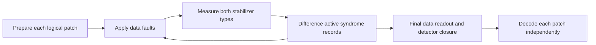

# Full surface-code memory circuit

`qec_timing.circuit.build_surface_code_program(d, q_d=1, basis="Z")`
specializes one Guppy program for odd `d >= 3` and `q_d` independent patches.
Compilation happens on the first emulator build. Each patch has `d²` data
qubits, `(d²−1)/2` checks of each type, and one logical qubit. All patches keep
their data live; sequential extraction reuses **one** ancilla, so the emulator
needs `q_d*d² + 1` qubits. There are no gates between patches.



## State preparation and extraction

For Z memory, start in `|0>^⊗d²`, measure all X stabilizers, then apply Z
corrections to normalize their random signs to +1. Corrections come from a
GF(2) right inverse of the X support matrix. They commute with every Z check
and logical Z, so the result is `|0_L>` with all stabilizers +1. For X memory,
start in `|+>^⊗d²` and interchange X and Z to prepare `|+_L>`.

Z extraction uses `|0>` ancilla, data-to-ancilla CNOTs, Z measurement. X
extraction uses `|+>` ancilla, ancilla-to-data CNOTs, X measurement. Each entire
check completes before the next starts. This is ideal extraction, not a
parallel four-layer hardware schedule or a circuit-level gate-noise model.

## Noise and timing

The existing `NoiseParams` and `constant_schedule` supply runtime `p_data`,
`p_read`, `dt`, and integer `n_rounds`. One Bernoulli draw per data qubit applies
X faults before each Z-memory extraction round. No additional idle interval is
added during preparation, extraction or final readout; `dt` describes the
phenomenological round, not elapsed emulator time. The active syndrome and
final data records are flipped classically at `p_read`. Complementary check
measurements are ideal; their records have no extra noise.

X memory conjugates the same data channel into Z faults and uses X-basis
readout. This tests the other CSS sector separately; it does not introduce
simultaneous X/Z noise, amplitude damping, or T1/T2 dynamics. There is exactly
one platform RNG, seeded by `base_seed + shot_index`.

## Run and decode

```python
from qec_timing.circuit import build_surface_code_program
from qec_timing.noise import NoiseParams
from qec_timing.schedule import constant_schedule
from qec_timing.reference.circuit import build_memory_circuit
from qec_timing.reference.decoder import build_decoder

schedule = constant_schedule(dt=0.5, T=10.0, lam=1.0)
noise = NoiseParams(p=0.015, lam=1.0, dt=schedule.dt, b_read=1.0)
program = build_surface_code_program(d=5, q_d=2)
result = program.run(
    p_data=noise.p_data, p_read=noise.p_read, dt=schedule.dt,
    n_rounds=schedule.n_rounds, base_seed=20261001, shots=512,
)
events = program.detection_events(result, schedule.n_rounds)
# list of arrays: (patches, rounds+1, checks); q_d=1 retains (rounds+1, checks)
observed = program.observables(result)  # (shots, patches)
reference = build_memory_circuit(
    program.layout, [noise.p_data] * schedule.n_rounds, noise.p_read,
)
predicted = program.decode(result, schedule.n_rounds, build_decoder(reference))
failures = predicted != observed  # per shot, per patch
```

This reference builder/decoder call applies directly to Z memory. For X memory
use a DEM with the X-check support/order and the column logical X observable;
the current reference builder only creates the Z-sector DEM. The circuit
accepts any single-patch `Decoder` conforming to that ordering.

## Additive output schema

Read each shot with `collate_tags()`. Legacy tags and Z-check ordering are
preserved for `q_d=1`. For multiple patches, `det` blocks run in **round,
patch, check** order, including the final closure. Each patch starts its own
64-bit packing, padded independently. Sparse indices are
`((round*q_d + patch)*n_checks + check)`; dense blocks have the same ordering.
`obs` repeats once per patch in patch order. `n_checks` and `n_words` are per
patch, with additive scalar `q_d` and `x_memory` metadata.

`complementary_syn` contains packed ideal opposite-sector syndromes for each
round and patch. It should remain zero under this one-sector model after
preparation. It has no final closure: the final readout measures only the active
basis. It is a diagnostic, not input to the existing decoder. `emit="none"`
omits both detector and diagnostic blocks; those cannot then be unpacked.

## Verification

`tests/test_surface_code_circuit.py` checks commuting CSS geometry and
preparation inverses through d=27, exhaustively checks both sector distances at
d=3, runs noiseless Z/X memories, isolates known faults on two patches, verifies
wire formats and decoder integration, compares noisy Z output exactly against
the retained stub with the same seed, and compares logical failures with the
independent reference using a 99.9% binomial interval. Large sweeps remain on
the existing reference path. Historical Stage 4a results are not relabelled as
full-circuit validation.

## Timing-premise validation (Stage 5)

`scripts/stage5_validation.py` runs this full circuit, including both X and Z
checks on every patch. Stage 4a still uses the retained stub. From the repository
root, with the project environment active:

```bash
python scripts/stage5_validation.py --quick --q-d 2
python scripts/stage5_validation.py --q-d 2
```

The quick command checks execution and result storage with low statistics. The
default scientific scan uses d=5,7, T=10, p=0.015, lambda=1, b_read=1, and
round counts 100,50,25,20,10,5 (intervals 0.1,0.2,0.4,0.5,1,2). Total storage
time stays fixed by setting `dt=T/n_rounds`. Defaults are 1000 full-circuit
shots per scan point, 2000 per confirmation point, and 20000 reference shots.
These full-circuit runs can take minutes; all counts and distances are CLI
options. Each configuration runs once with its entire shot budget.

The scan chooses the lowest mean failure probability across patches. Fresh
samples compare that interval with a preselected baseline (`--baseline-rounds`,
default 5, giving dt=2). Each patch is decoded and assessed separately. The
ratio is baseline error probability / selected error probability; evidence for
improvement requires its lower confidence bound to exceed one. Conservative
Clopper-Pearson bounds are adjusted across all distance/patch comparisons.
Selecting the baseline yields `baseline_selected`; a boundary selection is
flagged and does not establish an interior optimum. Zero failures and overlapping
ratio bounds produce an inconclusive result rather than a success claim.

Every invocation creates `results/stage5/<UTC timestamp>/` containing:

- `points.csv`: scan/confirmation counts, probabilities, confidence intervals,
  per-patch logical error per time, noise probabilities, seeds, and reference
  interval-overlap diagnostics. Reference patch index -1 denotes a single
  independent reference experiment shared by identical patches.
- `summary.json`: configuration, package versions, progress/completion status,
  adjusted confirmation ratio bounds, saturation warnings, and premise result.
- `logical_error_vs_interval.png`: measured scan probabilities divided by T,
  with confidence intervals and the fixed baseline marked.
- `run.log`: progress and confirmation results.

Partial points and failure status are saved if execution fails. Seeds use
disjoint shot-index ranges between configurations and confirmation jobs. Reference
interval overlap at 99.9% is a consistency diagnostic, not proof of equivalence.
Both stabilizer types are measured, but gates remain ideal and only the Z-memory
Pauli sector has the paper's phenomenological noise. This validates that model
on local Selene; it does not validate H2 physical noise or submit an Aqora job.
